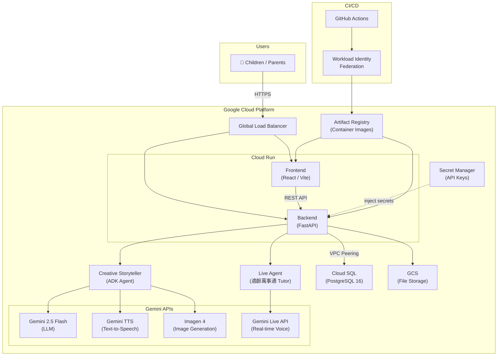

# StoryPal

[繁體中文](README.zh-TW.md)

**AI-powered interactive storytelling and tutoring platform for children (ages 3–8)**

StoryPal uses Google Gemini's multimodal capabilities — LLM, TTS, Imagen, and Live API — to create engaging, personalized learning experiences through voice-driven stories, interactive games, and an AI tutor.

## Key Features

| Feature | Description |
|---------|-------------|
| **Voice Story** | AI crafts personalized interactive stories with multi-character voices and beautiful illustrations (Creative Storyteller Agent) |
| **Voice Game** | Children make choices in the story world for an immersive interactive adventure |
| **AI Tutor** | AI tutor answers all kinds of curious questions in a child-friendly way (Live Agent) |

## Tech Stack

- **Backend** — Python 3.11+, FastAPI, SQLAlchemy 2.0, Alembic, Pydantic 2.0
- **Frontend** — TypeScript, React 18, Vite, Tailwind CSS, Zustand
- **Database** — PostgreSQL 16
- **AI** — Google Gemini (LLM, TTS, Imagen, Live API)
- **Infrastructure** — Terraform (GCP), Docker

## Prerequisites

- Python 3.11+
- Node.js 18+
- Docker & Docker Compose
- [uv](https://docs.astral.sh/uv/) (Python package manager)
- Google Gemini API Key

## Quick Start

```bash
# 1. Clone the repo
git clone https://github.com/howie/hackthon-storypal.git
cd hackthon-storypal

# 2. Set up environment variables
cp backend/.env.example backend/.env
cp frontend/.env.example frontend/.env

# 3. Set your Gemini API key in backend/.env
#    Edit backend/.env and replace: GEMINI_API_KEY=your-gemini-api-key

# 4. Install dependencies
make install

# 5. Start PostgreSQL & run migrations
make services-start
make db-migrate

# 6. Start dev servers
make dev
```

Open **http://localhost:5173** — the landing page shows all three features.

> **Note:** Auth is disabled by default (`DISABLE_AUTH=true`), so no Google OAuth setup is needed for local testing.

## How to Test Each Feature

### Voice Story (`/storypal`)
1. Click **Voice Story** on the landing page
2. Choose a story topic or enter a custom prompt
3. The AI generates a story with illustrations and multi-character voice narration
4. Interact with the story as it progresses

### Voice Game (`/story-game`)
1. Click **Voice Game** on the landing page
2. The AI presents a story scenario with choices
3. Make decisions to guide the adventure
4. Experience different story outcomes based on your choices

### AI Tutor (`/tutor`)
1. Click **AI Tutor** on the landing page
2. Ask any question a curious child might have
3. The AI responds in a child-friendly, age-appropriate way

## Architecture Overview



The project follows **Clean Architecture** with four layers:

```
backend/src/
├── domain/          # Entities, repository interfaces, domain services
├── application/     # Use cases, DTOs
├── infrastructure/  # Gemini providers, DB repos, storage
└── presentation/    # FastAPI routes, middleware
```

```
frontend/src/
├── routes/          # Page components (storypal, story-game, tutor, magic-dj)
├── components/      # Shared UI components
├── services/        # API client services
├── stores/          # Zustand state management
├── hooks/           # Custom React hooks
├── i18n/            # Bilingual support (en / zh-TW)
└── types/           # TypeScript type definitions
```

## Available Commands

| Command | Description |
|---------|-------------|
| `make install` | Install all dependencies (backend + frontend) |
| `make dev` | Start both dev servers (backend :8888, frontend :5173) |
| `make services-start` | Start PostgreSQL via Docker Compose |
| `make services-stop` | Stop PostgreSQL |
| `make db-migrate` | Run Alembic database migrations |
| `make test` | Run all tests (backend + frontend) |
| `make check` | Lint + format check + typecheck |
| `make format` | Auto-format code (ruff + eslint) |
| `make clean` | Clean build artifacts |

## Findings & Learnings

### 1. Gemini TTS — Multi-Character Voice Acting

Gemini's TTS API supports expressive, multi-voice narration ideal for children's stories. Key discoveries:

- **Voice selection for Traditional Chinese**: We tested all available voices and selected those with natural Mandarin pronunciation and child-friendly warmth. Different character archetypes (hero, villain, narrator) each map to a distinct voice profile.
- **Emotion & style control**: By embedding SSML-like cues in the prompt (e.g., "speak excitedly", "whisper mysteriously"), we achieved noticeably different emotional tones without changing the voice itself.
- **Multi-channel orchestration**: Each story character is assigned a consistent voice ID. The backend streams TTS segments in sequence, stitching them into a seamless audio experience so children hear a "cast" of characters, not a single narrator.

### 2. Imagen 4 — Story Illustration Generation

Generating consistent, child-safe illustrations across an entire story required significant prompt engineering:

- **Style consistency**: We prepend a shared style prefix (e.g., "watercolor children's book illustration, soft pastel palette, rounded characters") to every image prompt. This keeps the visual style cohesive across 5–8 illustrations per story.
- **Character continuity**: Describing recurring characters with fixed visual anchors ("a small girl with short black hair and a red raincoat") helps Imagen maintain recognizable characters across scenes, though perfect consistency remains challenging.
- **Safety guardrails**: Imagen 4's built-in safety filters align well with children's content. We added an additional prompt-level constraint ("age-appropriate, no scary imagery") and found that explicit positive framing ("friendly dragon") works better than negative constraints ("not scary dragon").

### 3. Live API — Real-Time Voice Interaction

The Gemini Live API powers the AI Tutor's real-time conversational experience. Lessons learned:

- **WebSocket proxy architecture**: The frontend cannot connect directly to Gemini's Live API (authentication, CORS). We built a FastAPI WebSocket proxy that authenticates the session server-side and relays bidirectional audio streams. This adds ~30–50 ms of latency but provides full control over session lifecycle.
- **Latency optimization**: We minimized round-trip time by (1) keeping a warm connection pool to Gemini, (2) streaming audio chunks in 100 ms frames rather than waiting for complete utterances, and (3) starting TTS playback before the full response is generated.
- **Graceful degradation**: Network instability is common on children's devices (tablets, family WiFi). We implemented automatic reconnection with exponential backoff and a visual "thinking" indicator so the child isn't confused by silence during brief disconnections.

### 4. Young Children's Speech Recognition — The Unsolved Challenge

Building a voice-first experience for 2–4 year-olds revealed fundamental limitations in current speech recognition:

- **Unique speech characteristics**: Young children exhibit unclear pronunciation, unstable speech tempo, limited vocabulary, and frequent non-verbal sounds (babbling, humming). These traits differ drastically from adult speech patterns that models are trained on.
- **Attempted tuning**: We referenced academic research on child speech recognition and experimented with adjustments — lowering VAD (Voice Activity Detection) thresholds, extending silence timeout windows, and tuning endpoint sensitivity — to better capture fragmented child utterances.
- **Current reality**: Despite tuning efforts, today's speech models remain fundamentally challenged by young children's speech. Recognition accuracy drops significantly compared to adult speakers. This is an active research frontier and a key area for future improvement in child-oriented voice AI.

## License

Apache License 2.0 — see [LICENSE](LICENSE) for details.
