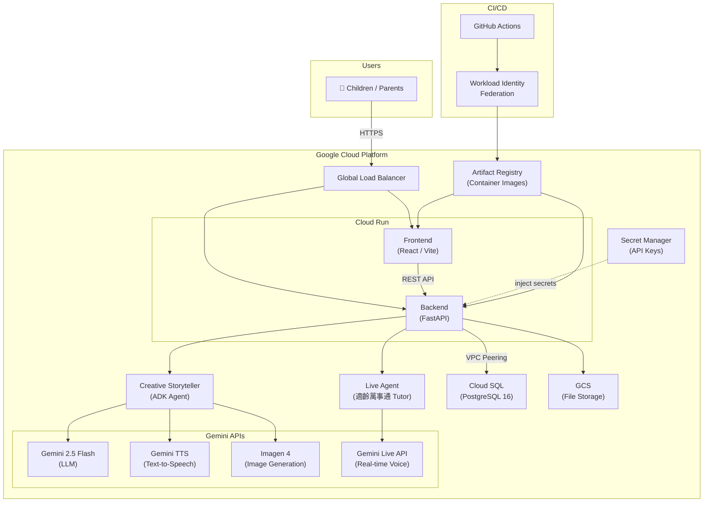

# StoryPal

[English](README.md)

**為 3–8 歲兒童打造的 AI 互動故事與教學平台**

StoryPal 運用 Google Gemini 的多模態能力 — LLM、TTS、Imagen 與 Live API — 透過語音驅動的故事、互動遊戲和 AI 家教，創造引人入勝的個人化學習體驗。

## 主要功能

| 功能 | 說明 |
|------|------|
| **Voice Story** | AI 為孩子量身打造互動故事，搭配多角色配音與精美插圖（Creative Storyteller Agent） |
| **Voice Game** | 孩子在故事世界中做出選擇，體驗沉浸式互動冒險 |
| **AI Tutor** | AI 家教以適合兒童的方式回答各種好奇問題（Live Agent） |

## 技術架構

- **Backend** — Python 3.11+, FastAPI, SQLAlchemy 2.0, Alembic, Pydantic 2.0
- **Frontend** — TypeScript, React 18, Vite, Tailwind CSS, Zustand
- **Database** — PostgreSQL 16
- **AI** — Google Gemini (LLM, TTS, Imagen, Live API)
- **Infrastructure** — Terraform (GCP), Docker

## 系統需求

- Python 3.11+
- Node.js 18+
- Docker & Docker Compose
- [uv](https://docs.astral.sh/uv/)（Python 套件管理工具）
- Google Gemini API Key

## 快速開始

```bash
# 1. Clone 專案
git clone https://github.com/howie/hackthon-storypal.git
cd hackthon-storypal

# 2. 設定環境變數
cp backend/.env.example backend/.env
cp frontend/.env.example frontend/.env

# 3. 在 backend/.env 中設定你的 Gemini API key
#    編輯 backend/.env 並替換：GEMINI_API_KEY=your-gemini-api-key

# 4. 安裝相依套件
make install

# 5. 啟動 PostgreSQL 並執行資料庫遷移
make services-start
make db-migrate

# 6. 啟動開發伺服器
make dev
```

開啟 **http://localhost:5173** — 首頁會顯示三大功能。

> **備註：** 開發環境預設停用身份驗證（`DISABLE_AUTH=true`），本機測試無需設定 Google OAuth。

## 功能使用方式

### Voice Story (`/storypal`)
1. 在首頁點擊 **Voice Story**
2. 選擇故事主題或輸入自訂提示
3. AI 會生成搭配插圖與多角色配音的故事
4. 隨著故事發展進行互動

### Voice Game (`/story-game`)
1. 在首頁點擊 **Voice Game**
2. AI 會呈現一個故事情境與選項
3. 做出決定來引導冒險方向
4. 根據你的選擇體驗不同的故事結局

### AI Tutor (`/tutor`)
1. 在首頁點擊 **AI Tutor**
2. 提出任何好奇的問題
3. AI 會以適合兒童、淺顯易懂的方式回答

## 架構概覽



本專案採用 **Clean Architecture**，分為四層：

```
backend/src/
├── domain/          # 實體、Repository 介面、領域服務
├── application/     # Use Cases、DTOs
├── infrastructure/  # Gemini providers、DB repos、儲存服務
└── presentation/    # FastAPI 路由、中介層
```

```
frontend/src/
├── routes/          # 頁面元件（storypal, story-game, tutor, magic-dj）
├── components/      # 共用 UI 元件
├── services/        # API 客戶端服務
├── stores/          # Zustand 狀態管理
├── hooks/           # 自訂 React hooks
├── i18n/            # 雙語支援（en / zh-TW）
└── types/           # TypeScript 型別定義
```

## 可用指令

| 指令 | 說明 |
|------|------|
| `make install` | 安裝所有相依套件（backend + frontend） |
| `make dev` | 啟動前後端開發伺服器（backend :8888, frontend :5173） |
| `make services-start` | 透過 Docker Compose 啟動 PostgreSQL |
| `make services-stop` | 停止 PostgreSQL |
| `make db-migrate` | 執行 Alembic 資料庫遷移 |
| `make test` | 執行所有測試（backend + frontend） |
| `make check` | Lint + 格式檢查 + 型別檢查 |
| `make format` | 自動格式化程式碼（ruff + eslint） |
| `make clean` | 清除建構產物 |

## 發現與心得

### 1. Gemini TTS — 多角色語音配音

Gemini 的 TTS API 支援富有表現力的多聲道朗讀，非常適合兒童故事。主要發現：

- **台灣中文語音選擇**：我們測試了所有可用語音，挑選出發音自然、語調溫暖適合兒童的聲音。不同角色原型（英雄、反派、旁白）各自對應不同的語音設定。
- **情感與風格控制**：透過在 prompt 中嵌入類 SSML 的提示（如「興奮地說」、「神秘地低語」），即使不切換語音，也能達到明顯不同的情感效果。
- **多聲道編排**：每個故事角色都被指定一致的 voice ID。後端依序串流 TTS 片段並拼接成完整音訊，讓孩子聽到的是「角色群」的演出，而非單一敘述者。

### 2. Imagen 4 — 故事插圖生成

要在整個故事中產生風格一致、適合兒童的插圖，需要大量的 prompt engineering：

- **風格一致性**：我們在每個圖片 prompt 前加上統一的風格前綴（如「水彩兒童繪本插畫、柔和粉彩色調、圓潤角色造型」），確保每個故事 5–8 張插圖的視覺風格一致。
- **角色連續性**：用固定的視覺描述錨點來描述重複出現的角色（如「一個留著黑色短髮、穿著紅色雨衣的小女孩」），有助於 Imagen 在不同場景中維持可辨識的角色形象，但完美的一致性仍具挑戰。
- **安全防護**：Imagen 4 內建的安全過濾器與兒童內容需求高度契合。我們額外在 prompt 層級加入限制（「適合兒童、避免恐怖畫面」），並發現正面描述（「友善的龍」）比否定描述（「不可怕的龍」）效果更好。

### 3. Live API — 即時語音互動

Gemini Live API 驅動 AI 家教的即時對話體驗。經驗分享：

- **WebSocket 代理架構**：前端無法直接連線 Gemini Live API（驗證與 CORS 限制），因此我們建置 FastAPI WebSocket 代理，在伺服器端完成認證並中繼雙向音訊串流。這增加約 30–50 毫秒延遲，但能完全掌控 session 生命週期。
- **延遲優化**：我們透過三種方式最小化來回延遲：(1) 維持對 Gemini 的預熱連線池，(2) 以 100 毫秒為單位串流音訊片段，而非等待完整語句，(3) 在完整回應生成前就開始 TTS 播放。
- **優雅降級**：兒童裝置（平板、家用 WiFi）的網路不穩定是常態。我們實作了指數退避的自動重連機制，並加入視覺化「思考中」指示，避免短暫斷線時的沉默讓孩子感到困惑。

### 4. 幼兒語音辨識 — 尚未解決的挑戰

為 2–4 歲幼兒打造語音優先體驗，揭示了當前語音辨識的根本限制：

- **獨特的語音特徵**：幼兒的發音不清晰、語速不穩定、詞彙量有限，且經常伴隨非語言聲音（咿呀學語、哼唱）。這些特徵與模型訓練所使用的成人語音模式截然不同。
- **嘗試調教**：我們參考了兒童語音辨識相關的學術論文，進行了多項調整 — 降低 VAD（語音活動偵測）門檻、延長靜音超時視窗、調整端點偵測敏感度 — 以更好地捕捉幼兒片段化的語句。
- **現況**：儘管經過調教，當前的語音模型面對幼兒語音仍然面臨根本性的挑戰。與成人說話者相比，辨識準確率顯著下降。這是一個活躍的研究前沿，也是兒童導向語音 AI 未來需要持續突破的關鍵領域。

## 授權條款

Apache License 2.0 — 詳見 [LICENSE](LICENSE)。
